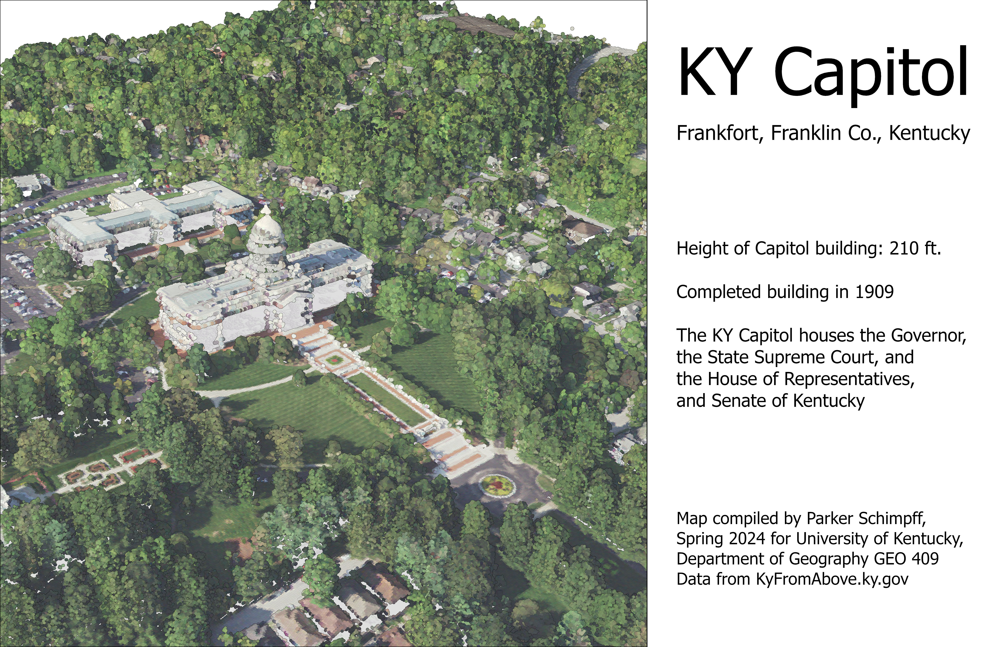
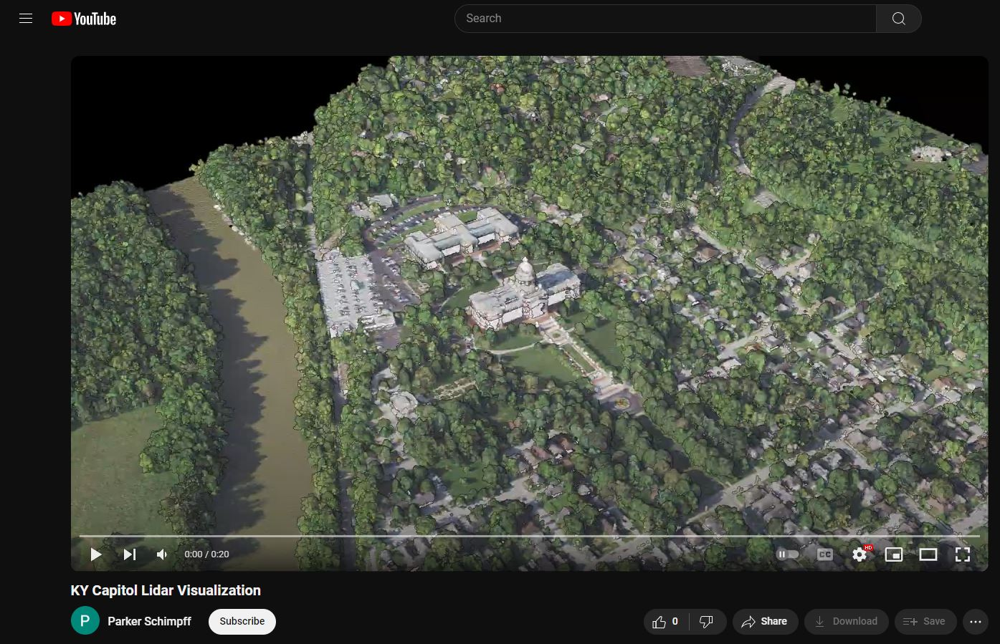

# Kentucky Capitol Building

The Kentucky Capitol Building has been in use since 1910. It houses the offices of the Governor and their cabinet, the Kentucky State Supreme Court, and both parts of the state congress. 

This webpage is part of the Lab 5 assignment for GEO 409.

[*Lidar Visualization of the KY Capitol Building*](KYCapitol-Lidar.pdf)

  
*[KY Capitol Lidar Visualization Youtube Link](https://youtu.be/n_uVBHIPjYw)*